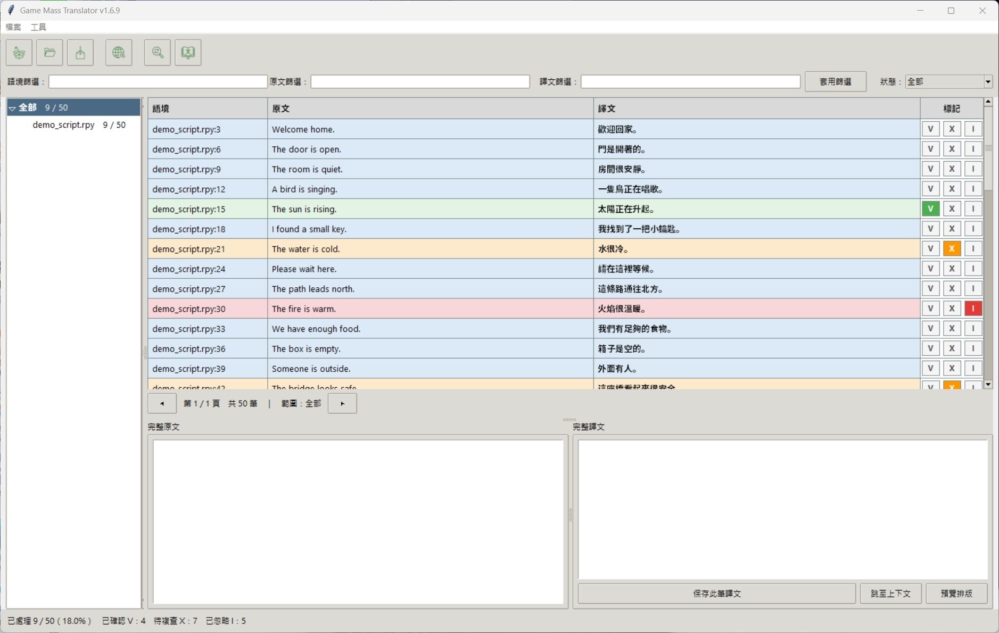

# Game Mass Translator

[繁體中文](README.md)

Game Mass Translator is a Windows game-translation tool that brings different game sources into one project, where you can translate, review, and install the result.

Current version: **1.6.9**. [Download the latest version](https://github.com/johnex2x/Game-Mass-Translator/releases)

## Features

- Supports multiple game sources, including Ren'Py, Unity, Translator++, and MTool.
- Lets you choose manual web, CLI, or Agent translation.
- Lets you review with V/X/I marks before installing and testing in the game.

## Four-step quick start

1. Download the ZIP from the [official Releases](https://github.com/johnex2x/Game-Mass-Translator/releases), extract it, and run `Game Mass Translator 1.6.9.exe`.
2. Click the large **Create Project from Game** icon and choose the game folder to create a `.rpytrans` project.
3. Click the large **Web Batch Translation** icon, send the batch to your chosen web AI, and paste the complete result back into the tool.
4. Review the translations, mark approved entries V, click the large **Install Translation to Game** icon, and verify the result in the game.

## Full guides

- [完整繁中使用手冊](docs/USER_GUIDE.zh-TW.md)
- [Complete English user guide](docs/USER_GUIDE.en.md)

## Supported sources

- Ren'Py
- Unity / XUnity.AutoTranslator / Naninovel / Mono
- Translator++ `.trans`
- MTool JSON

## Other links

- [Privacy](PRIVACY.md)
- [Software Use and Distribution Terms](LICENSE.md)
- [Security reporting](SECURITY.md)
- [GitHub Issues](https://github.com/johnex2x/Game-Mass-Translator/issues)
