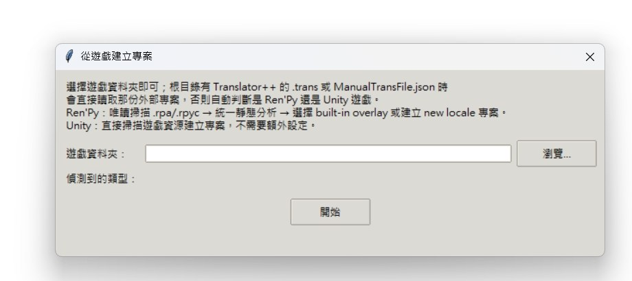
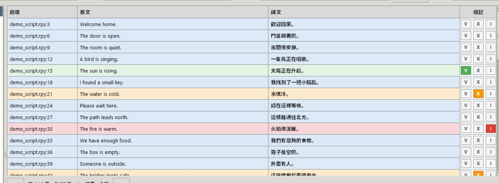
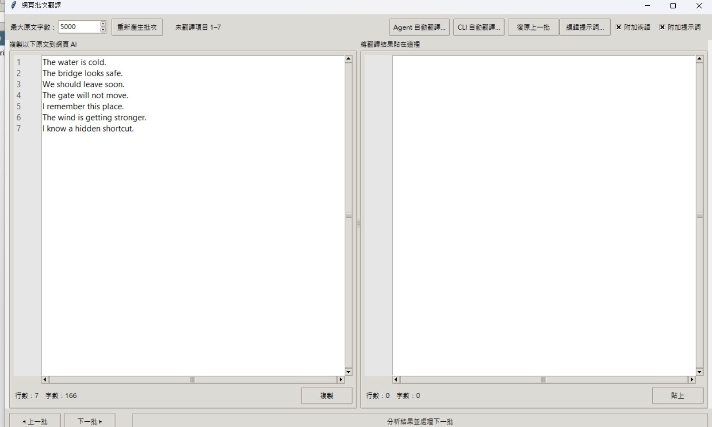
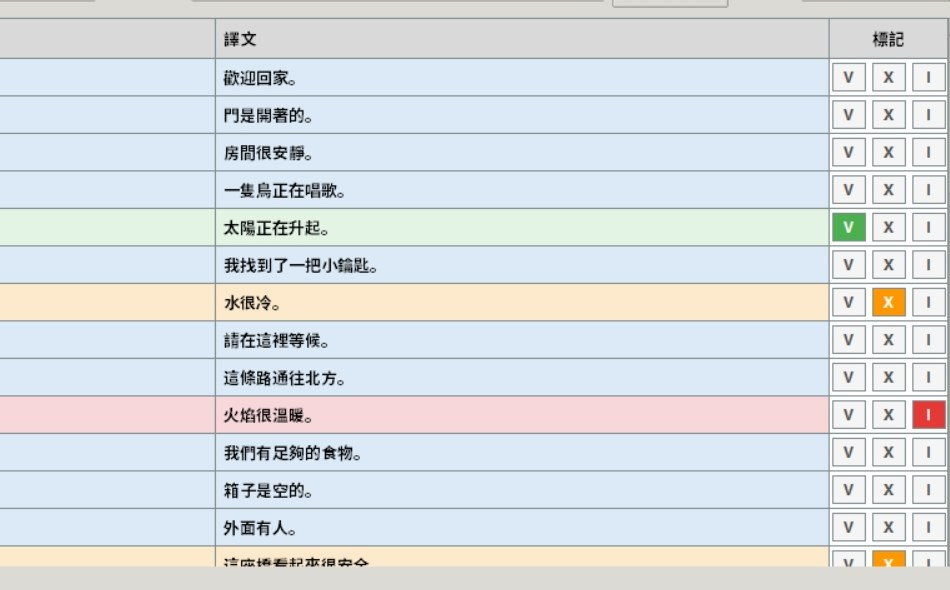
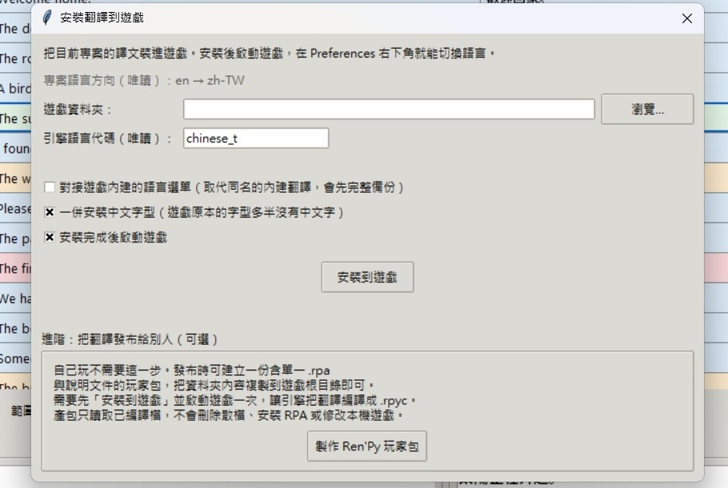
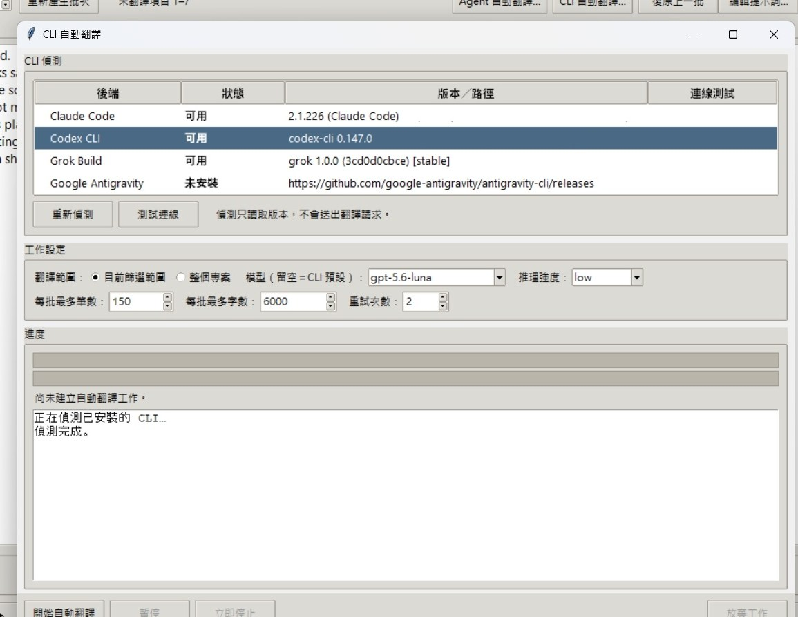
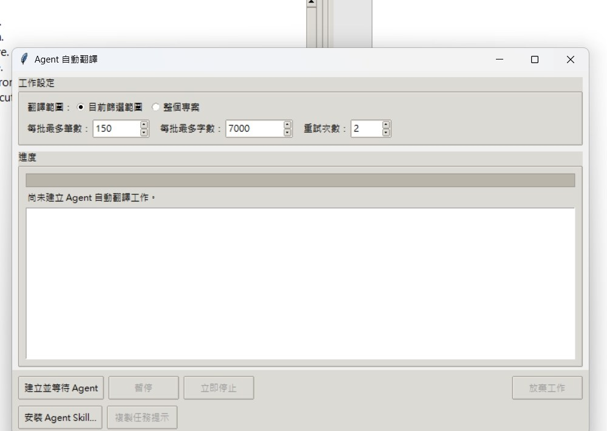
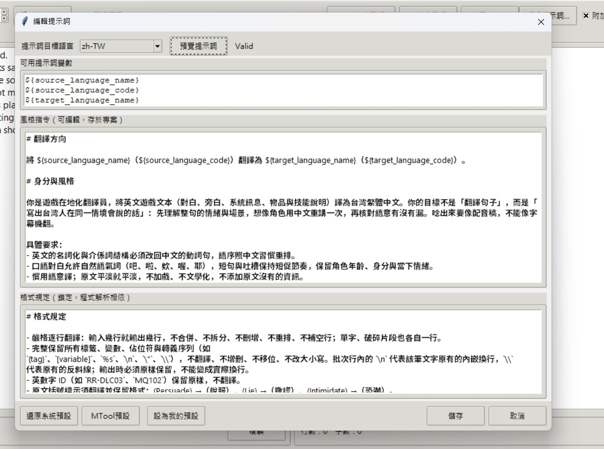
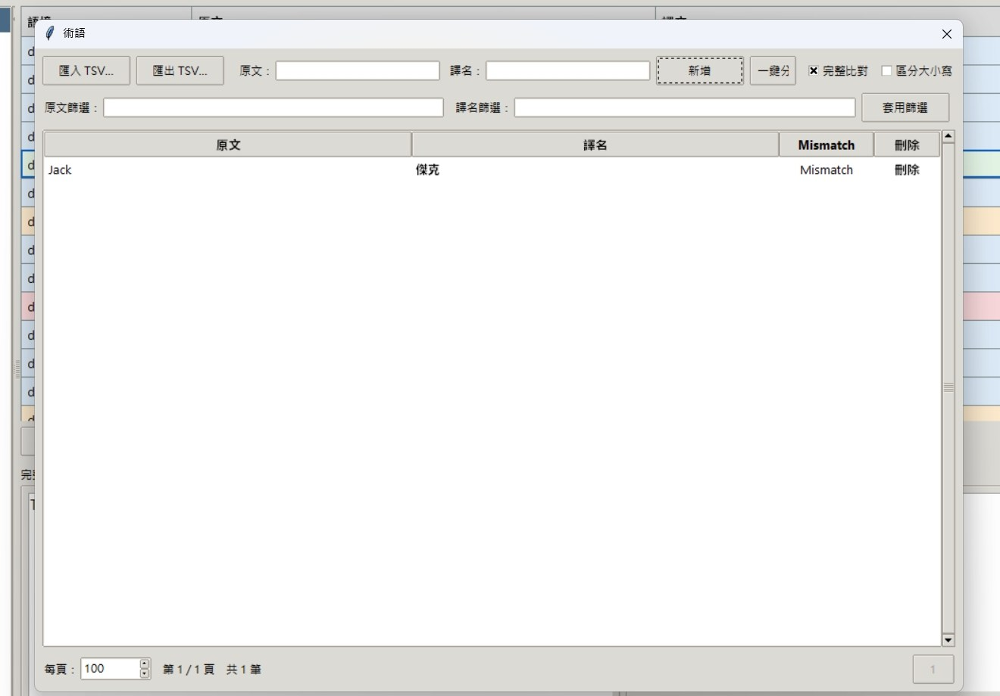

# Game Mass Translator User Guide

This guide is written for players and first-time translators. Complete section 2 once using manual web-based AI translation before trying CLI, Agent, glossary, or Player Package features.

## 1. Before you begin

### 1.1 How the tool works

Game Mass Translator collects game text and the required source snapshot in a `.rpytrans` project. You translate and review entries in the project, then choose whether to install the result in your own game or export a Player Package.

Project creation, editing, preview, and diagnostics are read-only with respect to the game source. The tool writes to a selected target only after you explicitly choose **Install Translation to Game** or an export action.

### 1.2 Four terms to know

- **Entry**: one source string and its translation.
- **`.rpytrans` project**: local SQLite user data containing the source snapshot, translations, marks, language direction, and install state. Back it up yourself; do not upload private projects to an Issue.
- **V/X/I**: V means confirmed for output, X means translate or review again, and I means intentionally ignored. Only V entries are written to a game or export.
- **Player Package**: a finished translation folder for other players; it does not include the game.

### 1.3 Privacy before sending text

Manual web translation means that you personally paste source text into a web AI service. CLI and Agent automation send text through the selected tool and the provider behind it. Confirm that you have permission to process the game content and that this complies with the service terms and any confidentiality requirements. See the [Privacy and Network Notice](../PRIVACY.md).

## 2. Complete your first translation

This section is the full beginner path: create a project, translate batches manually, review them, and install the result. The screenshots use the Traditional Chinese interface; switch languages from **Tools → Language / 語言** if needed.

### Step 1: Start and create a project

1. Extract the official ZIP and run the versioned EXE.
2. Click the create-project toolbar button, or open **Tools → Create Project from Game…**.
3. Click **Browse…** beside **Game folder** and select the game root. Do not select a save-game subfolder.
4. Check the detected type, then click **Start**. The tool chooses a Ren'Py, Unity, Translator++ `.trans`, or MTool JSON workflow from the folder contents.

If the root contains both a Translator++ `.trans` file and `ManualTransFile.json`, the tool asks which external project to import before engine detection. External projects take priority over engine detection.

### Step 2: Confirm the project and language direction

When the `.rpytrans` opens, inspect the left file tree, entry count, and source/target language. A Unity project can show evidence for more than one locale; confirm the direction before using an AI batch. An older project whose direction is not confirmed can still be browsed, edited, and exported manually, but AI preview, copy, and batch actions stay disabled.

### Step 3: Read the main table

The **Source** column is the game snapshot; **Translation** is what you may write back. Select a row and edit it in the **Full Source / Full Translation** panes. Short text can also be edited by double-clicking a translation cell. Enter saves, Escape cancels, and clicking elsewhere saves a changed value.

### Step 4: Generate a manual batch

1. Click **Web Batch Translation** on the toolbar.
2. Set **Maximum source characters**. An entry is never split; the batch follows the current tree, filter, and status range.
3. For the first batch, leave **Append prompt** and **Append glossary** enabled. The prompt describes the direction and format rules; the glossary adds matching terminology.
4. Click **Copy** and paste the complete batch into the web AI service you use (for example, Gemini).

The output must preserve entry order, keep one source line paired with one translation line, and contain no explanation, Markdown heading, or extra blank line. Preserve `{tag}`, `[variable]`, `%s`, backslashes, and Ren'Py or RPG Maker control codes exactly.

### Step 5: Paste and analyze

1. Paste the complete AI reply into the right pane. Keeping a surrounding code block is acceptable.
2. Click **Analyze Result and Next Batch**. The tool removes an outer code block and checks row count, numbering, and control codes.
3. A successful check writes translations to the project as **unconfirmed**. A row-count or control-code mismatch writes nothing from that batch; correct the reply and try again.
4. If the AI returns an `===Glossary===` section, review it in the glossary dialog. New terms are saved only after you click **Add Selected Items**.

Continue with **Next Batch** until the current range is complete. Use **Regenerate Batch** when you need a new selection. **Undo Previous Batch** restores only the most recent translation write; it does not remove glossary terms that you already approved.

### Step 6: Review and mark V

Newly pasted or manually saved translations return to the translated-but-unconfirmed state. Check meaning, tone, control codes, variables, and line breaks. Mark a row **V** when it is safe to write to the game. Use **X** when it needs another translation and **I** when the original should intentionally remain.

Use Shift to select a range, Ctrl-click to add or remove rows, and Ctrl+A to select every row in the current filtered range. Applying V to multiple rows skips rows already marked I; select one row by itself when changing I directly to V. Before installation, filter for unconfirmed or X entries to focus the remaining review.

### Step 7: Install and verify in the game

1. Confirm that at least one row is V and save the project.
2. Click **Install Translation to Game**.
3. Choose the correct game folder and read the language direction, target files, file count, and warnings.
4. Enable only options you understand. Unity routes that change `*_Data`, or Ren'Py routes that replace an existing locale, require explicit confirmation.
5. Click **Install Translation to Game** and wait for a success summary. If **Launch game after installation** is checked, the tool attempts to start the game; otherwise launch it yourself and switch to the target language.

The basic success condition is a successful summary, the correct in-game language, and at least one V-marked entry visible as a translation in the game.

## 3. Main window, editing, and marks

### 3.1 The current range

The left file tree, context/source/translation filters, and status dropdown form one **current range**. The table, Ctrl+A, search and replace, and web batches all use it. Check the count and range shown in the pager before applying a bulk action.

### 3.2 Editing rules

- The Source column is a snapshot and cannot be edited directly. Recreate or re-import a project when the source itself changes.
- The full translation pane supports right-click copy, cut, and paste. Select one line and use **Add Glossary Term** to create a term.
- Embedded newlines and backslashes are data. In a batch, `\n` is a reversible representation; the tool restores it when the result is pasted back. Do not merge or split entries yourself.
- Saving a new translation clears V and X so you review it again. I remains because it represents an intentional decision not to output.

### 3.3 What V/X/I do

| Mark | Meaning | Install/export | Next batch |
|---|---|---|---|
| V | Confirmed | Written | Skipped |
| X | Translate again | Not written | Selected again |
| I | Ignore | Not written; game keeps original | Skipped |
| No mark with translation | Translated but unconfirmed | Not written | Waiting for review |

## 4. Three translation methods

| Method | Best for | How text leaves the machine | Main benefit |
|---|---|---|---|
| Manual web batch | First-time users and careful review | You copy text to a web AI | Easiest to understand and fully user-controlled |
| CLI automatic translation | Users already signed into an official CLI | The tool invokes your selected CLI | Repeats batching, writing, and retries automatically |
| Agent automatic translation | Users of Claude Code, Codex CLI, or another coding agent | The agent claims batches through a local endpoint | The agent can resume while the GUI keeps review and install authority |

All three methods share batch validation, glossary accumulation, and the rule that translations remain unconfirmed until you mark V. A project can have only one unfinished automatic job at a time.

### 4.1 CLI automatic translation (optional)

Click **CLI Automatic Translation…** in the web batch window. Refresh detection, choose an official CLI that you installed and signed into yourself (Claude Code, Codex CLI, Grok Build, or Google Antigravity), then choose the current range or whole project, per-batch entry and character limits, and retry count.

Detection reads versions only; it does not send a translation request. The consent message lists the source text, prompt, and matching terms that will be sent, not the complete `.rpytrans` database. The project is temporarily read-only while running. A failed batch is never partially written. Sign-in, allowance, timeout, and network failures pause without pretending to skip entries. Progress is stored in `.rpytrans` and can resume; automatic translations still require manual review and V marks.

### 4.2 Agent automatic translation (optional)

On first use, click **Install Agent Skill…** in the Agent window and approve installation into the coding agent you use. Then click **Agent Automatic Translation…** in the web batch window, choose the range, limits, and retries, and click **Create and Wait for Agent**.

The tool exposes pending batches, validates submissions, and reports progress through a local loopback endpoint. The agent cannot choose a game, change the range, mark V, or install a translation. Return to the GUI and review all results when the job finishes. Stopping a job invalidates unclaimed tokens; completed and validated translations remain.

## 5. Prompts, glossary, and diagnostics

### 5.1 Edit the prompt

Click **Edit Prompt…** in the web batch window to choose the target language, inspect available variables, preview the rendered prompt, and save a project prompt. Common variables include `${source_language_name}`, `${source_language_code}`, `${target_language_name}`, `${target_language_code}`, `${target_style}`, and `${engine_format_rules}`.

**Save** changes only the current project. **Set as My Default** saves a per-language default on this computer. The fixed format section is required by the batch parser; keep the instructions about preserving control codes and one-to-one lines. Unknown variables prevent saving and batch generation.

### 5.2 Glossary and Mismatch

Open **Glossary…** from the toolbar to add, edit, delete, import, or export a UTF-8 TSV glossary. Glossary terms are embedded in `.rpytrans` and are not automatically shared between projects. Select one line in the full source or translation pane and use **Add Glossary Term** to prefill a pair.

**Mismatch** finds entries whose source contains a glossary term but whose translation does not contain its required translation. It is a review warning: it does not rewrite text or block installation. Correct the translation, analyze again, and mark the reviewed row V.

### 5.3 Search, replace, and diagnostics

Use the context/source/translation filters at the top to narrow the current range. **Tools → Translation Diagnostics** checks format, untranslated coverage, and other warnings. Diagnostics are read-only; they do not change translations, marks, or game files.

## 6. Engine routing and input preparation

Use this table to choose a route. If you are unsure, select the game root and let the tool report the detected type instead of guessing individual files.

| Source | Create project from | Basic output/install | Important boundary |
|---|---|---|---|
| Ren'Py | A folder containing `game/`, `.rpa`, or `.rpy` | Locale overlay, `.rpy`/`.rpa`, or Player Package | Source or built-in baseline changes create explicit conflicts |
| Unity/XUnity.AutoTranslator | A Unity folder containing `<Game>_Data` | XUAT dictionary and config | `*_Data` is read-only by default; missing runtime downloads require consent |
| Unity/Naninovel | A Unity IL2CPP x64 game whose text map is verified | `*_Data/StreamingAssets/aa` and required bridges | Direct mode is offered only after verification; first launch may build a cache |
| Unity Mono static patch | A folder with a verified Mono target | Protected target resource files | Advanced, writes `*_Data`, and requires consent plus a pristine backup |
| Translator++ `.trans` | A `.trans` file at the game-folder root | A new `_translated.trans` file | Translator++ writes the game; the source `.trans` stays unchanged |
| MTool JSON | `ManualTransFile.json` at the root | `<Game>_translated.json` | Only JSON values are changed; the source JSON stays unchanged |

### 6.1 Ren'Py

The tool can read loose or RPA sources and preserves an immutable built-in baseline. Installation creates a locale overlay and does not repack the original RPA. Replacing an existing loose locale requires explicit consent and a verified backup. During re-import, source or identifier changes appear as conflicts; unresolved conflicts are not installed.

### 6.2 Unity/XUnity.AutoTranslator

The standard route writes a sidecar dictionary and the required `AutoTranslatorConfig.ini` changes, with a `.bak` backup. If BepInEx or XUnity is missing, the tool downloads pinned versions only after you confirm, and verifies their SHA-256. For missing Chinese glyphs, use the installation summary to choose the TTFLoader, MoeFont, or yozai route. A font failure does not erase a completed dictionary installation.

### 6.3 Naninovel and Unity Mono

Naninovel direct mode validates bundles, catalogs, bridges, and fonts in staging before writing `*_Data/StreamingAssets/aa`. The first IL2CPP launch may take one or two minutes to build interop caches. Mono static patching rebuilds from a `.gmt-pristine` backup and verifies each replacement; unexpected content stops the operation.

### 6.4 Translator++ and MTool

For RPG Maker, Translator++ `.trans` is usually preferred because it preserves complete `data/*.json` fields. Consider MTool when a game heavily relies on runtime name replacement. Translator++ flow: create and save a `.trans` in Translator++ → translate here → export `_translated.trans` → in Translator++, use **Export Project → Export to Folder** to write the game. MTool flow: create a project → translate and mark V → use the toolbar export action. The source file is not overwritten by this tool in either route.

## 7. Install to your own game

Close the game before installing, back up saves and important settings, and read the installation summary. Only V entries are output; unconfirmed, X, and I entries keep the original text.

- Ren'Py writes the selected locale overlay and does not repack the original RPA.
- Standard Unity/XUAT normally writes only sidecars, configuration, and confirmed runtime dependencies, not `*_Data`.
- Naninovel direct mode and Mono static patching explicitly list `*_Data` writes and require confirmation each time.
- MTool shows **Export MTool JSON** rather than writing the game; Translator++ exports a new `.trans` and performs the game write itself.

Read the success summary and backup location before launching a short test. If a game update causes a baseline or hash mismatch, do not force an overwrite; recreate the project for the new version and import only translations you can re-confirm.

## 8. Create a Player Package

A Player Package is an output for other players and does not include the game. Test the translation in your own copy first:

1. Mark every entry you intend to share as V and test it in-game.
2. For a Ren'Py `.rpa` package, install first and launch once so Ren'Py compiles the generated `.rpy` files into `.rpyc`.
3. Use **Create Ren'Py Player Package** in the advanced installation area, or choose the full-runtime or dictionary-only package for the Unity route.
4. Share the output folder together with its notices and instructions. Existing output is never overwritten; duplicate names become `(2)`, `(3)`, and so on.

Confirm that you have the right to distribute the translation and support files. Do not put the game, a private `.rpytrans`, or the tool ZIP in the package.

## 9. Troubleshooting, privacy, and safety

**Windows shows Unknown Publisher.** The public EXE is unsigned. Download from the official Release again and verify the ZIP SHA-256; do not disable security features.

**The game has no translation.** Confirm that entries are V, the language direction and engine route are correct, then inspect the installation summary and BepInEx/game logs.

**The AI reply has the wrong number of lines.** Regenerate the same batch and ask for one translation line per source line. Do not combine multiple batches or remove the line breaks after the entry numbers.

**The font shows squares.** Follow the Unity installation summary for the root TTF, loader/AssetBundle, and 7-Zip. You can verify the dictionary installation first and then retry another font route.

**Installation is refused after a game update.** This is usually drift or a baseline mismatch. Keep the old project and backup, create a project for the new version, and import only translations you can review again.

There is no telemetry, account system, or automatic updater. Unity runtime and font downloads happen only after explicit confirmation and are hash-verified. Whether text is sent through a web AI, CLI, or Agent depends on the service you choose. Use [GitHub Issues](https://github.com/johnex2x/Game-Mass-Translator/issues) for public reports after removing game content, private paths, and secrets; use the [private security channel](../SECURITY.md) for vulnerabilities.
